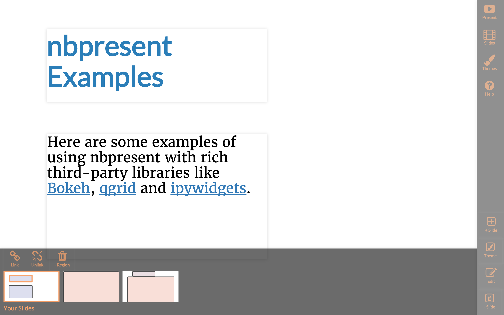

# nbpresent

[](https://anaconda.org/anaconda-nb-extensions/nbpresent/builds) [](https://anaconda.org/anaconda-nb-extensions/nbpresent) [](https://pypi.python.org/pypi/nbpresent)

> remix your [Jupyter Notebooks](http://jupyter.org) as interactive slideshows



## Using
After [installing](#install) (and potentially enabling) as appropriate for your environment, relaunch the Jupyter Notebook: in the main toolbar, you will get two new buttons that toggle the _Authoring_ and _Presenting_ modes.

## User Documentation and Community
When _Authoring_, you can click on the `(?)` icon to see a number of in-Notebook guided tours that show all the features, as well as see links to community pages:

- [mailing list](https://groups.google.com/forum/#!forum/nbpresent) for general or long-term discussion and announcements
- [issues](https://github.com/Anaconda-Platform/nbpresent/issues) for technical issues, as well as feature requests
- [chat](https://gitter.im/Anaconda-Platform/nbpresent) for quickly connecting with other users

## Related Projects
- [live_reveal/RISE](https://github.com/damianavila/RISE), the original inspiration for this work, based on [reveal.js](https://github.com/hakimel/reveal.js/).
- [RMarkdown](http://rmarkdown.rstudio.com/ioslides_presentation_format.html) presentations

## Publishing
When you are happy with your presentation, you can download the standalone HTML file from the _File -> Download as -> Presentation (.html)_ menu item.

## Install

> Note: installing directly off this repo won't work, as we don't ship the built JavaScript and CSS assets. See more about [developing](#develop) below.

### `pip`
```shell
pip install nbpresent
python -m nbpresent.install
```

Then either run 
```python
%reload_ext nbpresent
```

_every time you start the notebook_ or _enable_ the extension for every notebook launch:
```shell
python -m nbpresent.install --enable --user
```

> `nbpresent.install` accepts all of the same arguments as `jupyter nbextension install`.

### `conda`
```shell
conda install -c anaconda-nb-extensions nbpresent
```

This will enable `nbpresent` by default.

## Export
Stock `nbconvert` doesn't store quite enough information, so you'll need to do something like this:
```shell
nbpresent -i notebooks/README.ipynb -o README.html
```
The resulting file can be hosted and viewed (but not edited!) on any site.

If you have installed [nbbrowserpdf](https://github.com/Anaconda-Platform/nbbrowserpdf), you can also export to pdf:
```shell
nbpresent -i notebooks/README.ipynb -f pdf -o README.pdf
```

You can also pass in and get back streams:
```shell
cmd_that_generates_ipynb | nbpresent -f pdf > README.pdf
```

Here's the whole doc:


```python
!nbpresent --help
```

    usage: nbpresent [-h] [-i IPYNB] [-o OUTFILE] [-f {html,pdf}]
    
    Generate a static nbpresent presentation from a Jupyter Notebook
    
    optional arguments:
      -h, --help            show this help message and exit
      -i IPYNB, --ipynb IPYNB
                            Input file (otherwise read from stdin)
      -o OUTFILE, --outfile OUTFILE
                            Output file (otherwise write to stdout)
      -f {html,pdf}, --out-format {html,pdf}
                            Output format


## Develop
This assumes you have cloned this repository locally:
```
git clone https://github.com/Anaconda-Platform/nbpresent.git
cd nbpresent
```

### Repo Architecture

The `nbpresent` nbextension is built from `./src` into `./nbpresent/static/nbresent` with:
- `less` for style
- `es6` (via `babel`) for javascript
- `browserify` for packaging

The `nbpresent` python module (server component) is stored in the `/nbpresent` folder

### Getting Started
You'll need conda installed, either from [Anaconda](https://www.continuum.io/downloads) or [miniconda](http://conda.pydata.org/miniconda.html). You can import a Python 3.5 development environment named `nbpresent` from `./environment.yml`.

```shell
conda update env
source activate nbpresent
```

We _still_ use `npm` for a lot of dependencies, so then run:
```shell
npm install
npm run build
```

### Ensure development asset loading
To ensure that you always get the right assets, install the nbextension with the `symlink`, `force` and `enable` options:
```shell
python -m nbpresent.install --overwrite --symlink --enable --user
```

If developing in a [conda](http://conda.pydata.org/docs/) environment, you would want to pass in `--prefix` instead of `--user`.

### Chore Automation
| Task | Command |
|------|---------|
| Build all of the front end assets with sourcemaps for development | `npm run build` |
| Rebuild on every save | `npm run watch` |
| Rebuild all of the front end assets, and optimize it | `npm run dist` |
| Run the CasperJS and `nose` tests  | `npm run test` |
| Check code style |  `npm run lint` |
| Build the conda package | `npm run pkg:conda` |
| Build **and upload** the pypi **test** package | `npm run pkg:pypi` |
| Build **and upload** the pypi **release** package | `npm run pkg:pypi:release` |
| Build the ESDoc and Sphinx documentation | `npm run docs` |

## Changelog

### 3.0.1
- minor build changes

### 3.0.0
- Update to notebook 4.2

### 2.0.0
- Theme editor removed. Significant work required to stabilize to public release quality.
- Adding some themes extracted from reveal.js

### 1.1.1
- fixing enabling on windows with `nb_config_manager` 0.1.3
- trimming down conda packages
- more reproducible builds

### 1.1.0 (Unreleased)
- fixing issue with slides without regions and some layouts crashing editor [#58](https://github.com/Anaconda-Platform/nbpresent/issues/58)
- adding JS extensibility of themes (partial [#44](https://github.com/Anaconda-Platform/nbpresent/issues/44))
  - see [Extending nbpresent](https://github.com/Anaconda-Platform/nbpresent/blob/master/notebooks/Extending%20nbpresent.ipynb)

### 1.0.0
- [Theme editor](https://github.com/Anaconda-Platform/nbpresent/pull/41)
- Much more consistent UI
- Mnay bug fixes and more testing
